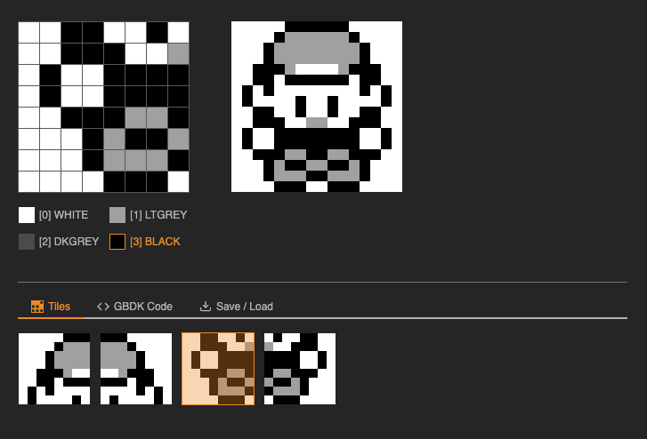
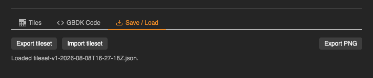
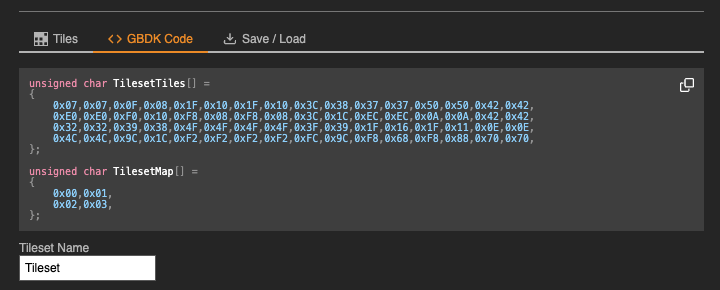

# gb-sprite

A Game Boy sprite editor web app, built with Vite and vanilla JavaScript (no framework), using native Web Components.

Inspired-by [Game Boy Tile Tool](https://nathanheffley.itch.io/game-boy-tile-tool).

This is an attempt to provide some improved ergonomics and additional tooling to support a wholistic workflow.

<p align="center">
  
</p>

## Features

- **Tile editor** — paint an 8x8 tile pixel-by-pixel against the 4-color Game Boy grayscale palette (`WHITE`/`LTGREY`/`DKGREY`/`BLACK`). Click-and-drag paints continuously across cells.
- **Tile gallery & sprite preview** — the tileset is 4 tiles, editable individually via the gallery and previewed together, laid out 2 tiles wide, as the assembled sprite.

  <p align="center">
    
  </p>

- **GBDK code export** — a live-updating, copy-to-clipboard view of the GBDK-2020 C source (tile bitmap array + tileset map array) for the current tileset, under a name you choose.

  <p align="center">
    
  </p>

- **Tileset save/load** — export the current tileset to a JSON file and re-import it later, round-tripping exactly.
- **PNG export** — export the full tileset as a single indexed (8-bit colormap, 4-color/2bpp) PNG frame, sized to divide evenly into 8x8 tiles — ready for GBDK-2020 tooling like `png2asset`. This is a one-way export (unlike the JSON tileset save, it doesn't import back in).

  <p align="center">
    
  </p>

### Hotkeys

| Key                | Action                                        |
| ------------------ | --------------------------------------------- |
| `0`–`3`            | Select palette color 0–3 (`WHITE`–`BLACK`)    |
| `` ` `` (backtick) | Select palette color 0 (`WHITE`), same as `0` |

Hotkeys are ignored while a text input is focused.

## Dev setup

Requires Node `^20.19.0 || >=22.12.0` (see `.nvmrc` / `engines` in `package.json`). If you use `nvm`:

```sh
nvm use
```

Install dependencies and start the dev server:

```sh
npm install
npm run dev
```

Other commands:

```sh
npm run build    # production build
npm run preview  # preview the production build locally
npm run format   # format all files with Prettier
```
